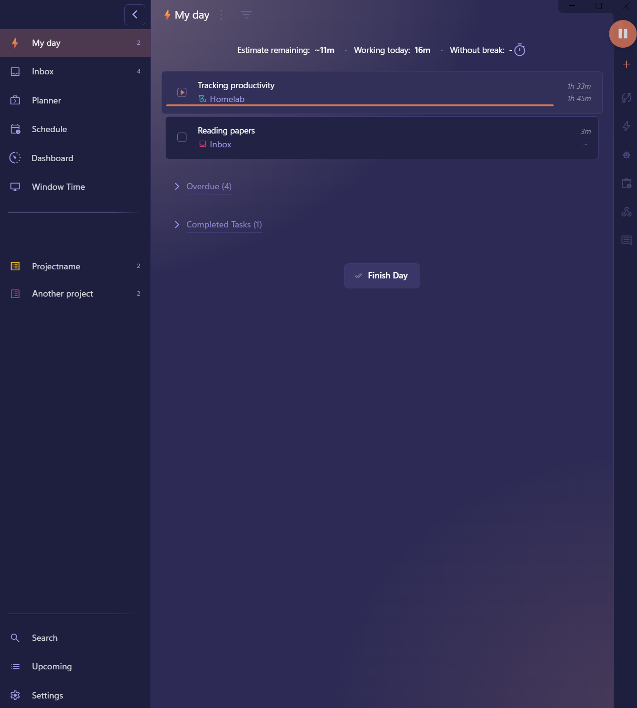
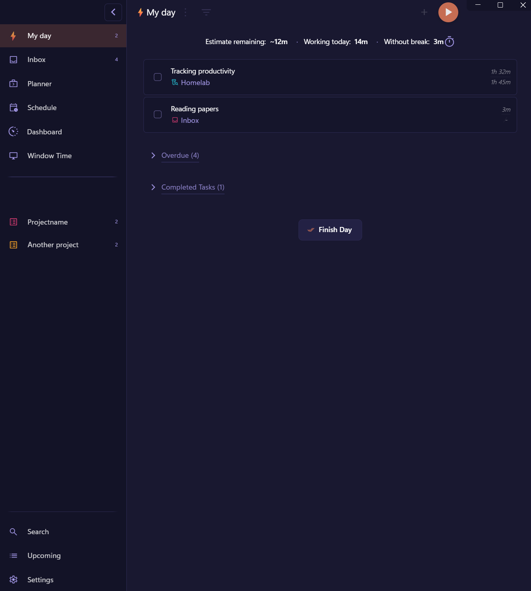
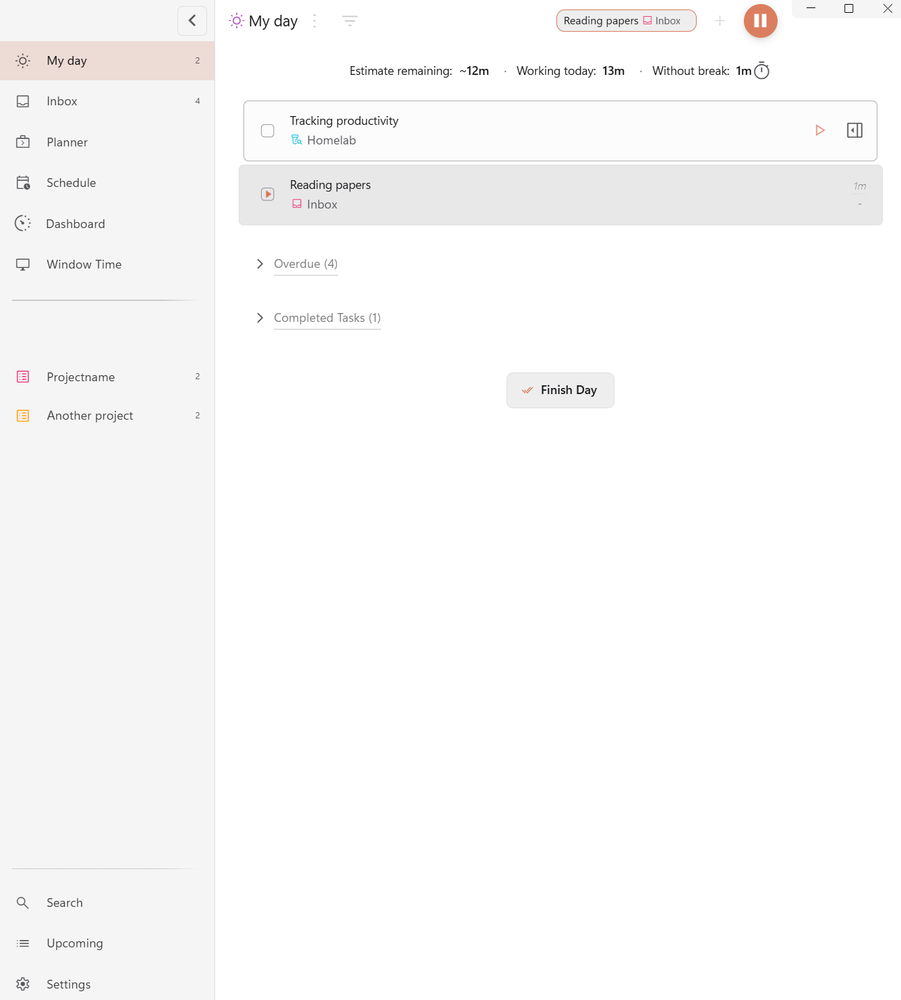
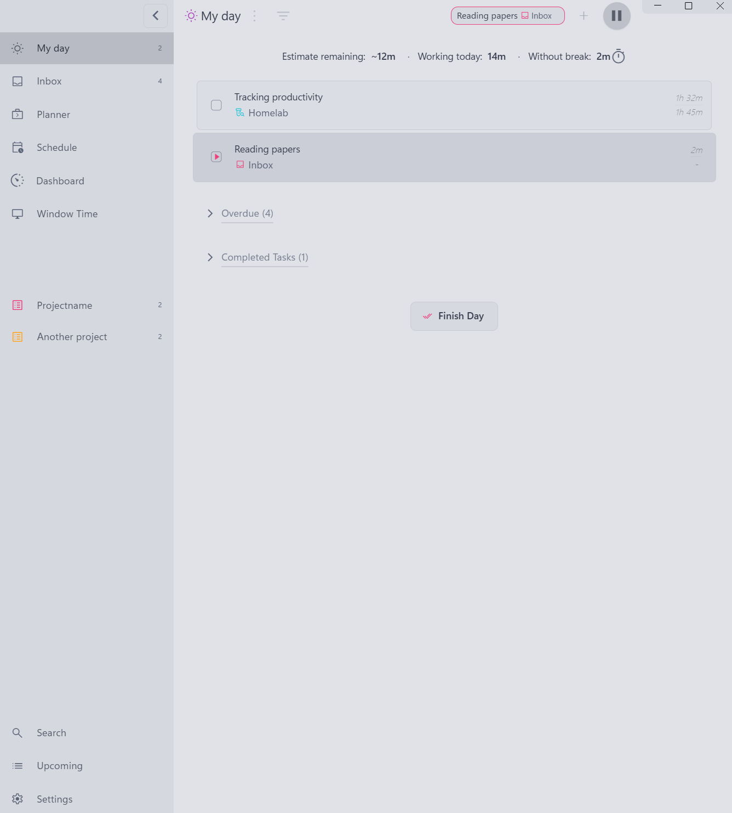
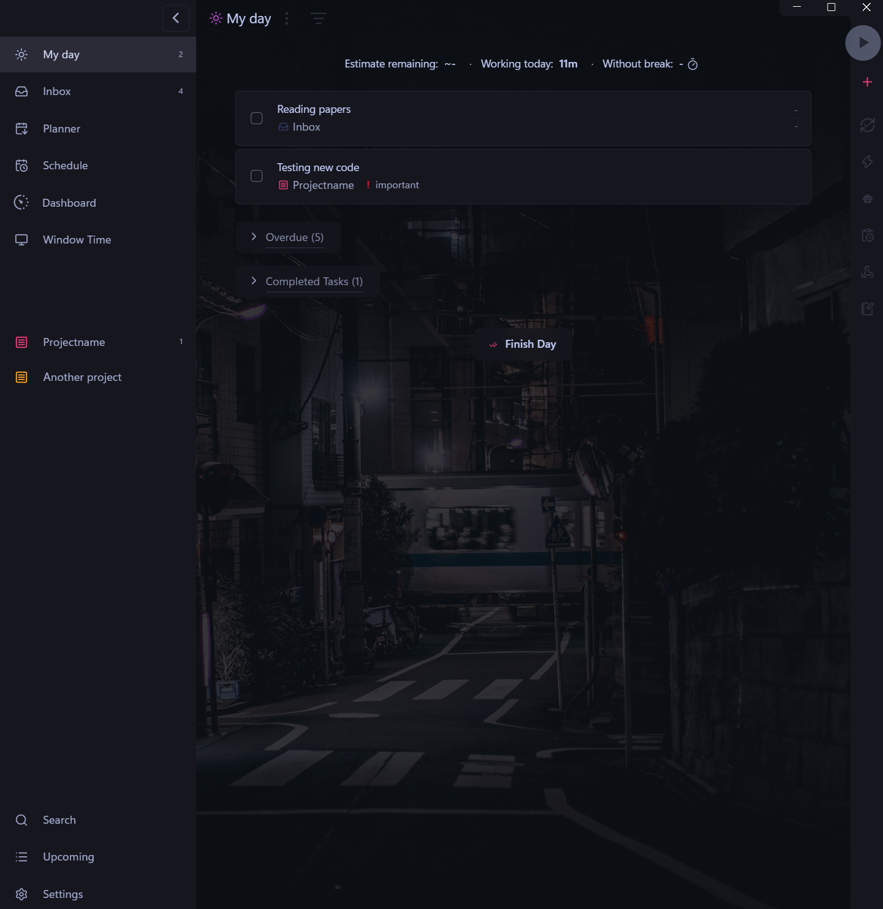
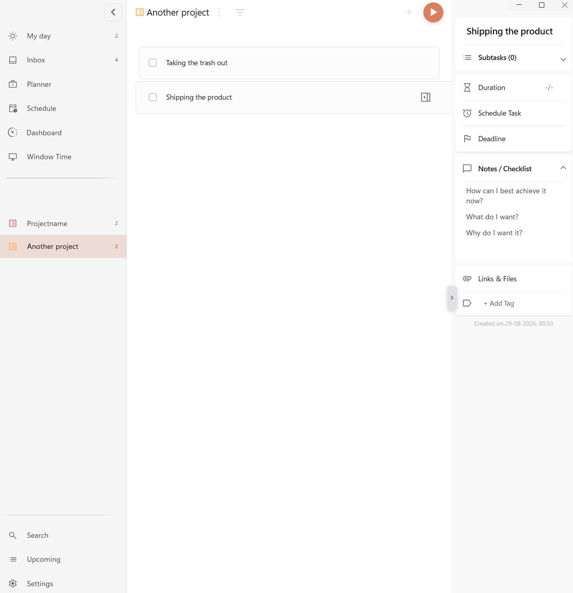
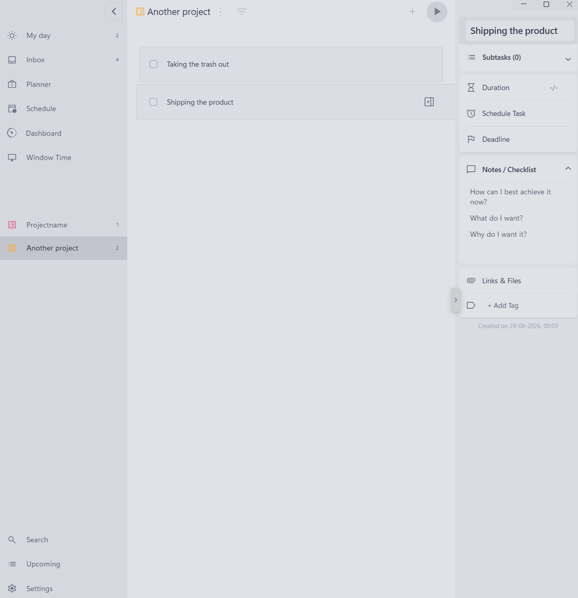
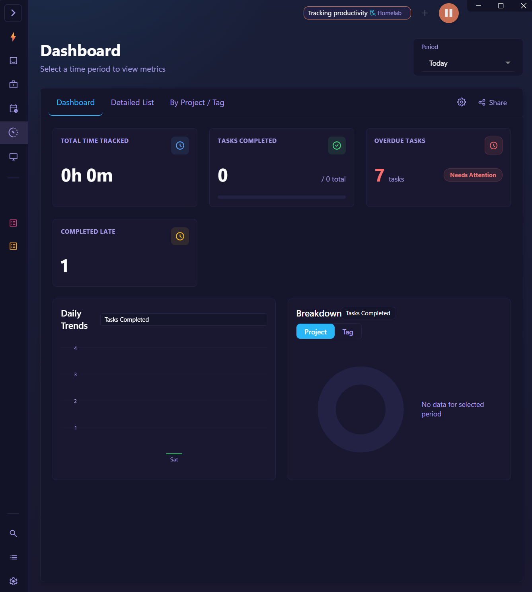

# Purple Tokyo Themes
### Themes for Super Productivity

Three light/dark theme pairs for [Super Productivity](https://github.com/super-productivity/super-productivity), each a self-contained CSS file installed from the app's own theme picker. All three carry the same set of interface changes and differ in the palette they put in the light and the dark slot.

| File | Light slot | Dark slot |
| --- | --- | --- |
| `shades-of-purple.css` | Shades of Purple — indigo surfaces, white text, a muted violet for supporting text, salmon as the accent | Shades of Purple taken deeper — near-black indigo, the same white text and salmon accent |
| `paper-purple.css` | Licht — white and near-white zinc surfaces, salmon as the accent | Shades of Purple |
| `minimal-tokyo.css` | Tokyo Light — cool blue-grey surfaces, ink-blue text | Tokyo Night — near-black blue surfaces, pale blue text |

The palettes are remapped onto Super Productivity's [theming contract](https://github.com/super-productivity/super-productivity/blob/master/docs/theming-contract.md): the surface ladder and the ink primitives drive the semantic tokens, so most of the app follows from the two colour blocks at the top of each file. The rest covers the tokens the base pins to a neutral grey ramp that the ladder does not reach.

## Screenshots

| | Light slot | Dark slot |
| --- | --- | --- |
| `shades-of-purple.css` |  |  |
| `paper-purple.css` |  |  |
| `minimal-tokyo.css` |  |  |

Shades of Purple sits in the dark slot of both purple files, so that one screenshot stands for the pair.

The task detail panel, as a column of cards, in each light palette:

| Light (`paper-purple.css`) | Tokyo Light (`minimal-tokyo.css`) |
| --- | --- |
|  |  |

And the Dashboard in Paper Purple, with the sidebar collapsed to its icon rail:

## Install

Settings → General → Theme → **Install theme…**, then pick the `.css` file you want. It is stored locally in IndexedDB; nothing leaves the machine. Re-uploading a file with the same name overwrites the previous version. The app keeps that stored copy and does not read the file again, so after editing a theme on disk, install it again to see the change. Installing more than one file puts all of them in the list.

The picker labels a theme after its filename, so rename the file if you want a different name in the list.

## Wallpapers

Wallpapers are set through the app's own wallpaper dialog. Ones that suit these palettes:

- `minimal-tokyo.css`, dark mode — [a night street in Tokyo](https://images.unsplash.com/photo-1493515322954-4fa727e97985?ixid=M3w3NzgxMTF8MHwxfHNlYXJjaHwxN3x8bmlnaHR8ZW58MHwwfHx8MTc4Nzc3NDU5MHww&ixlib=rb-4.1.0&w=2560&q=85&auto=format): neon on wet asphalt in the same blues the palette is built from.
- The purple pair, dark mode — [a night sky over a mountain lake](https://images.unsplash.com/photo-1419242902214-272b3f66ee7a?ixid=M3w3NzgxMTF8MHwxfHNlYXJjaHw2fHxuaWdodHxlbnwwfDB8fHwxNzg3Nzc0NTkwfDA&ixlib=rb-4.1.0&w=2560&q=85&auto=format) or [a ship wreck at night](https://images.unsplash.com/photo-1513436539083-9d2127e742f1?ixid=M3w3NzgxMTF8MHwxfHNlYXJjaHwxNXx8bmlnaHR8ZW58MHwwfHx8MTc4Nzc3NDU5MHww&ixlib=rb-4.1.0&w=2560&q=85&auto=format): deep blues and violets the veil settles into.

### No wallpaper in one project or tag

Super Productivity has one global wallpaper, and every project and tag that does not set its own falls back to it. There is no setting for "no wallpaper here".

These themes add one: type `none` or `null` in that project or tag's background image field, in both the light and the dark slot. The wallpaper and its shading disappear, leaving the flat page colour.
